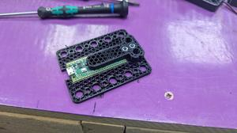
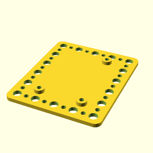
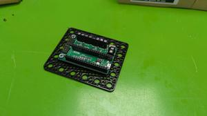
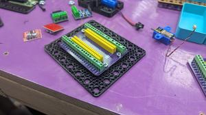

# Oomlout oobb holder electronic breakout board mcu pico raspberry pi

## parts

### oobb_test_base_04_05_03
* link: [/oobb_test_base_04_05_03](oobb_test_base_04_05_03)  
  
 

### oobb_test_base_05_06_03_ex_electronic_breakout_board_mcu_pico_robotic_42_mm_width_64_mm_height_green_pcb
* link: [/oobb_test_base_05_06_03_ex_electronic_breakout_board_mcu_pico_robotic_42_mm_width_64_mm_height_green_pcb](oobb_test_base_05_06_03_ex_electronic_breakout_board_mcu_pico_robotic_42_mm_width_64_mm_height_green_pcb)  
  
 

### oobb_test_base_06_07_03_ex_electronic_breakout_board_mcu_pico_screw_terminal_55_mm_width_73_mm_height_purple_pcb
* link: [/oobb_test_base_06_07_03_ex_electronic_breakout_board_mcu_pico_screw_terminal_55_mm_width_73_mm_height_purple_pcb](oobb_test_base_06_07_03_ex_electronic_breakout_board_mcu_pico_screw_terminal_55_mm_width_73_mm_height_purple_pcb)  
  
 
